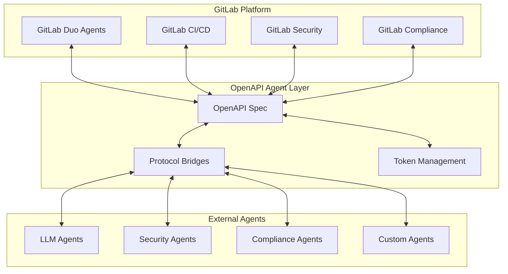

# GitLab Duo Agentic Platform Integration

## Overview

The OpenAPI for AI Agents Standard is designed to seamlessly integrate with GitLab Duo's Agentic Platform, enabling enterprises to leverage GitLab's AI-powered DevSecOps capabilities while maintaining universal agent interoperability.

## GitLab Duo Agentic Platform Alignment

### Native Integration Points

The OpenAPI for AI Agents Standard complements GitLab Duo's agentic capabilities:

1. **Code Suggestions & Generation**
   - Our standard enables GitLab Duo agents to communicate with external AI systems
   - Preserve context across GitLab's code suggestions and third-party AI tools
   - Unified token management across GitLab Duo and enterprise AI agents

2. **Vulnerability Detection & Security**
   - Bridge GitLab Duo's security scanning with specialized security agents
   - Orchestrate multi-agent security workflows using GitLab as the hub
   - Compliance reporting that integrates GitLab's security dashboard

3. **CI/CD Pipeline Intelligence**
   - AI agents that optimize GitLab CI/CD pipelines
   - Automatic pipeline generation based on OpenAPI specifications
   - Intelligent test selection and execution

4. **Documentation & Knowledge Management**
   - GitLab Duo's documentation generation enhanced with external agents
   - Knowledge graph integration across GitLab wikis and AI agents
   - Automated API documentation from OpenAPI specs

## Strategic Partnership Opportunities

### For GitLab

1. **Extended Ecosystem**
   - Connect GitLab Duo to 1000+ AI agents via OpenAPI standard
   - Enable customers to use GitLab as their AI orchestration hub
   - Maintain vendor neutrality while ensuring interoperability

2. **Enterprise Adoption**
   - Compliance-ready agent framework (ISO 42001, NIST AI RMF)
   - Token cost optimization for enterprise scale
   - Multi-protocol support (MCP, A2A, custom)

3. **Competitive Advantage**
   - First DevSecOps platform with universal AI agent interoperability
   - Reduced integration costs for enterprise customers
   - Future-proof architecture for emerging AI protocols

### For Organizations Using GitLab

1. **Unified AI Operations**
   - Single platform for code, security, and AI agent management
   - Consistent governance across GitLab Duo and external agents
   - Centralized token usage and cost tracking

2. **Enhanced Capabilities**
   - Augment GitLab Duo with specialized industry agents
   - Custom agent development using GitLab CI/CD
   - Seamless integration with existing GitLab workflows

3. **Risk Mitigation**
   - Avoid vendor lock-in with open standards
   - Maintain compliance across all AI operations
   - Audit trail integration with GitLab's compliance features

## Implementation Architecture



## GitLab CI/CD Components

### Available Components

1. **Agent Validation Component**
   - Validates OpenAPI specifications in merge requests
   - Ensures compliance with AI agent standards
   - Automatic certification level assessment

2. **Token Usage Monitor**
   - Tracks token usage across pipeline runs
   - Alerts on budget overruns
   - Optimizes prompts for cost reduction

3. **Security Scanning**
   - MAESTRO framework security assessment
   - Vulnerability scanning for AI agents
   - Compliance validation (ISO 42001, NIST AI RMF)

4. **Agent Deployment**
   - Automated agent deployment to multiple environments
   - Protocol bridge configuration
   - Health check integration

### Quick Start

```yaml
# .gitlab-ci.yml
include:
  - component: gitlab.com/openapi-ai-agents/components/agent-validator@1.0.0
  - component: gitlab.com/openapi-ai-agents/components/token-monitor@1.0.0
  - component: gitlab.com/openapi-ai-agents/components/security-scan@1.0.0
  - component: gitlab.com/openapi-ai-agents/components/agent-deploy@1.0.0

stages:
  - validate
  - test
  - security
  - deploy

variables:
  AGENT_SPEC: "openapi.yaml"
  CERTIFICATION_LEVEL: "silver"
  TOKEN_BUDGET: "10000"
```

## Integration Patterns

### Pattern 1: GitLab-Centric Orchestration

```yaml
# Use GitLab as the central hub for AI agent orchestration
workflow:
  name: "gitlab_centric"
  trigger: "merge_request"
  steps:
    - gitlab_duo_analysis
    - external_agent_validation
    - multi_agent_consensus
    - gitlab_deployment
```

### Pattern 2: Hybrid Intelligence

```yaml
# Combine GitLab Duo with specialized agents
workflow:
  name: "hybrid_intelligence"
  agents:
    - type: "gitlab_duo"
      capabilities: ["code_suggestions", "security_scan"]
    - type: "external_specialist"
      capabilities: ["domain_expertise", "compliance"]
  orchestration: "parallel_validation"
```

### Pattern 3: Progressive Enhancement

```yaml
# Start with GitLab Duo, progressively add capabilities
workflow:
  name: "progressive_enhancement"
  base: "gitlab_duo"
  enhancements:
    - when: "complexity > high"
      add: "specialist_agents"
    - when: "compliance_required"
      add: "governance_agents"
```

## Roadmap for GitLab Integration

### Phase 1: Foundation (Q1 2025)
- [ ] GitLab CI/CD component library
- [ ] Basic protocol bridge for GitLab Duo
- [ ] Token usage integration with GitLab metrics

### Phase 2: Deep Integration (Q2 2025)
- [ ] Native GitLab Duo agent wrapper
- [ ] Unified security scanning
- [ ] Compliance dashboard integration

### Phase 3: Advanced Features (Q3 2025)
- [ ] AI-powered pipeline optimization
- [ ] Multi-agent merge request reviews
- [ ] Intelligent test generation

### Phase 4: Enterprise Scale (Q4 2025)
- [ ] GitLab Ultimate integration
- [ ] Advanced governance features
- [ ] Cost optimization at scale

## Benefits for GitLab Customers

### Immediate Benefits
- **Cost Reduction**: 60-80% token cost savings
- **Faster Integration**: 85% reduction in AI agent integration time
- **Compliance Ready**: Built-in ISO 42001 and NIST AI RMF
- **Vendor Flexibility**: Use any AI provider through GitLab

### Long-term Value
- **Future-Proof**: Support for emerging AI protocols
- **Ecosystem Growth**: Access to growing agent marketplace
- **Innovation Velocity**: Faster AI feature deployment
- **Risk Mitigation**: Avoid vendor lock-in

## Call to Action

### For GitLab
1. **Partner with OpenAPI AI Agents Consortium**
2. **Integrate standard into GitLab Duo roadmap**
3. **Co-develop enterprise features**
4. **Joint go-to-market strategy**

### For GitLab Customers
1. **Adopt OpenAPI AI Agents Standard**
2. **Use GitLab CI/CD components**
3. **Contribute to standard development**
4. **Share success stories**

## Resources

- **GitLab CI/CD Components**: [gitlab.com/openapi-ai-agents/components](https://gitlab.com/openapi-ai-agents/components)
- **Integration Guide**: [docs.openapi-ai-agents.org/gitlab](https://docs.openapi-ai-agents.org/gitlab)
- **Support**: gitlab-integration@openapi-ai-agents.org

---

*The OpenAPI for AI Agents Standard is designed to complement and enhance GitLab Duo's Agentic Platform, creating a unified AI development experience for enterprises.*