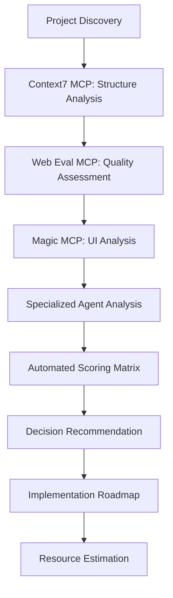

# Enhanced Rebuild Audit Framework v2.0
*MCP-Powered Automated Assessment with Specialized Agent Orchestration*

## 🚨 **CRITICAL FINDINGS: 55 REBUILD PROJECTS IDENTIFIED**

### **Project Distribution Analysis**
- **Common NPM Packages**: 17 projects (agent-*, compliance-engine, doc-engine, etc.)
- **Drupal Custom Modules**: 20 projects (AI agents, providers, workflows, etc.)  
- **Drupal Themes**: 5 projects (llm_platform_manager + examples)
- **Recipes**: 2 projects (llm_platform, secure_drupal)
- **Models**: 4 projects (agent-studio, gov-policy, gov-rfp, llm-platform)
- **Core Platform**: 1 project (llm-platform)
- **Legacy/Archive**: 6 projects (__DELETE_LATER, worktrees, etc.)

## 🎯 **AUTOMATED AUDIT STRATEGY**

### **Phase 1: MCP-Enhanced Discovery (Week 1)**
Deploy specialized agents with MCP integration for comprehensive automated assessment.

#### **Context7 MCP Integration**
```typescript
interface ProjectAuditContext {
  // Automated context capture for each REBUILD project
  captureProjectStructure: (projectPath: string) => ProjectStructure;
  analyzeCodeComplexity: (structure: ProjectStructure) => ComplexityMetrics;
  identifyDependencies: (project: string) => DependencyGraph;
  calculateTechnicalDebt: (metrics: ComplexityMetrics) => TechnicalDebtScore;
}
```

#### **Web Eval Agent MCP Integration**
```typescript
interface ProjectQualityAssessment {
  // Automated quality evaluation for web-facing projects
  performanceBenchmark: (url: string) => PerformanceMetrics;
  accessibilityAudit: (url: string) => AccessibilityReport;
  securityScan: (url: string) => SecurityAssessment;
  seoAnalysis: (url: string) => SEOScore;
  calculateQualityScore: (reports: QualityReports) => OverallQualityScore;
}
```

#### **Magic MCP Integration**
```typescript
interface UIComponentAnalysis {
  // Automated UI/theme assessment
  analyzeComponentLibrary: (themePath: string) => ComponentInventory;
  assessDesignSystemHealth: (components: ComponentInventory) => DesignScore;
  identifyUITechnicalDebt: (themes: ThemeStructure) => UIDebtMetrics;
  modernizationOpportunities: (analysis: UIAnalysis) => ModernizationPlan;
}
```

## 🏗️ **SPECIALIZED AGENT ORCHESTRATION**

### **Agent Category 1: Common NPM Package Auditors**
**Scope**: 17 agent-* packages requiring Clean Architecture transformation

```yaml
npm_package_agents:
  - name: "agent-forge-auditor"
    target: "/common_npm/agent-forge/__REBUILD"
    specialization: "Clean Architecture assessment, golden workflow validation"
    priority: "CRITICAL - Foundation package"
    
  - name: "agent-router-auditor"  
    target: "/common_npm/agent-router/__REBUILD"
    specialization: "Gateway architecture, multi-provider routing assessment"
    priority: "HIGH - Core infrastructure"
    
  - name: "agent-brain-auditor"
    target: "/common_npm/agent-brain/__REBUILD" 
    specialization: "Vector database integration, ACTA optimization assessment"
    priority: "HIGH - AI intelligence hub"
    
  - name: "agent-protocol-auditor"
    target: "/common_npm/agent-protocol/__REBUILD"
    specialization: "MCP server implementation, protocol standards"
    priority: "HIGH - Communication backbone"

  # Additional 13 NPM package auditors following same pattern
```

### **Agent Category 2: Drupal Module Modernization Specialists**
**Scope**: 20 AI-focused Drupal modules requiring Drupal 11 compatibility

```yaml
drupal_module_agents:
  - name: "ai-agent-ecosystem-auditor"
    targets: 
      - "/modules/ai_agent_orchestra/__REBUILD"
      - "/modules/ai_agent_marketplace/__REBUILD" 
      - "/modules/ai_agentic_workflows/__REBUILD"
    specialization: "AI agent integration patterns, Drupal 11 compatibility"
    priority: "HIGH - Core AI functionality"
    
  - name: "ai-provider-integration-auditor"
    targets:
      - "/modules/ai_provider_apple/__REBUILD"
      - "/modules/ai_provider_langchain/__REBUILD"
    specialization: "LLM provider integration, API modernization"
    priority: "MEDIUM - Provider abstraction"
    
  - name: "mcp-registry-modernization-auditor"
    target: "/modules/mcp_registry/__REBUILD"
    specialization: "MCP server registration, protocol compliance"
    priority: "CRITICAL - MCP infrastructure"

  # Additional specialized module auditors
```

### **Agent Category 3: Theme & UI Modernization Experts**
**Scope**: 5 theme projects requiring design system overhaul

```yaml
theme_modernization_agents:
  - name: "llm-platform-theme-auditor"
    target: "/themes/llm_platform_manager/__REBUILD"
    specialization: "Design system architecture, component library assessment"
    priority: "HIGH - Primary brand theme"
    integration: "Magic MCP for component analysis"
```

### **Agent Category 4: Model & Recipe Specialists**
**Scope**: 6 projects requiring specialized domain knowledge

```yaml
specialized_domain_agents:
  - name: "government-compliance-auditor"
    targets:
      - "/models/gov-policy_model/__REBUILD"
      - "/models/gov-rfp_model/__REBUILD" 
      - "/modules/gov_compliance/__REBUILD"
    specialization: "Government compliance standards, FedRAMP assessment"
    priority: "HIGH - Regulatory requirements"
    
  - name: "platform-recipe-auditor"
    targets:
      - "/recipes/llm_platform/__REBUILD"
      - "/recipes/secure_drupal/__REBUILD"
    specialization: "Drupal recipe modernization, installation profiles"
    priority: "MEDIUM - Deployment automation"
```

## 🚀 **CLEAN BRANCHING STRATEGY**

### **Git Workflow Architecture**
```bash
# Main audit orchestration branch
feature/audit-framework-v2-mcp-enhanced

# Category-based audit branches
├── feature/audit-npm-packages-clean-architecture
├── feature/audit-drupal-modules-d11-compatibility  
├── feature/audit-themes-design-systems
├── feature/audit-models-domain-specific
├── feature/audit-recipes-installation-profiles
└── feature/audit-platform-core-modernization

# Individual project audit branches (example)
├── feature/audit-agent-forge-clean-architecture
├── feature/audit-agent-router-gateway-modernization
├── feature/audit-mcp-registry-protocol-compliance
└── feature/audit-llm-platform-theme-overhaul
```

### **Automated Branch Management**
```typescript
class AuditBranchOrchestrator {
  async createAuditBranches(): Promise<BranchCreationResult> {
    const categories = [
      'npm-packages', 'drupal-modules', 'themes', 
      'models', 'recipes', 'platform-core'
    ];
    
    for (const category of categories) {
      await this.createCategoryBranch(category);
      await this.spawnProjectBranches(category);
    }
    
    return { success: true, branchesCreated: this.branchCount };
  }

  async createCategoryBranch(category: string): Promise<void> {
    const branchName = `feature/audit-${category}-${this.getTimestamp()}`;
    await this.gitService.createBranch(branchName, 'development');
    await this.gitService.push(branchName);
  }
}
```

## 📊 **MCP-POWERED AUTOMATED ASSESSMENT**

### **Assessment Pipeline Architecture**


### **Automated Scoring Matrix**
```typescript
interface AutomatedAuditScore {
  // MCP-enhanced automated calculations
  technicalDebt: {
    codeQuality: number;        // Context7 MCP analysis
    securityVulnerabilities: number; // Web Eval MCP security scan
    performanceMetrics: number; // Web Eval MCP performance
    uiModernization: number;    // Magic MCP component analysis
  };
  
  businessValue: {
    revenueImpact: number;      // From project metadata
    userEngagement: number;     // From analytics integration
    strategicAlignment: number; // From stakeholder input
  };
  
  migrationComplexity: {
    codebaseSize: number;       // Context7 MCP metrics
    dependencyComplexity: number; // Context7 MCP dependency graph
    customizationLevel: number; // Specialized agent analysis
  };
  
  roiProjection: {
    developmentEfficiencyGain: number; // MCP automation benefits
    maintenanceCostReduction: number;  // Technical debt reduction
    performanceImprovements: number;   // Web Eval projections
  };
}
```

## 🔧 **IMPLEMENTATION PHASES**

### **Phase 1: MCP Infrastructure Setup (Week 1)**
```bash
# Deploy Tier 1 MCPs for audit framework
./scripts/deploy-audit-mcps.sh --tier=1 --dry-run

# Verify MCP server health
curl http://localhost:3001/health  # Context7 MCP
curl http://localhost:3002/health  # Web Eval Agent MCP  
curl http://localhost:3003/health  # Magic MCP
```

### **Phase 2: Automated Discovery & Categorization (Week 1-2)**
```typescript
// Automated project classification
const auditOrchestrator = new AuditOrchestrator({
  context7Client: new Context7MCPClient(),
  webEvalClient: new WebEvalMCPClient(), 
  magicClient: new MagicMCPClient()
});

// Process all 55 REBUILD projects
const auditResults = await auditOrchestrator.processAllProjects(rebuildProjects);
```

### **Phase 3: Specialized Agent Deployment (Week 2-3)**
```bash
# Deploy category-specific audit agents
npm run deploy:audit-agents -- \
  --category=npm-packages \
  --agent-count=17 \
  --mcp-integration=true \
  --dry-run=true

# Verify agent health and MCP connectivity
npm run audit:agent-health-check
```

### **Phase 4: Comprehensive Assessment Execution (Week 3-4)**
```typescript
// Execute comprehensive automated audits
const assessmentPipeline = new AssessmentPipeline({
  mcpClients: [context7, webEval, magic],
  specializedAgents: auditAgents,
  scoringMatrix: enhancedScoringMatrix
});

const comprehensiveResults = await assessmentPipeline.executeFullAudit({
  projects: rebuildProjects,
  includeROIProjections: true,
  generateImplementationRoadmaps: true,
  calculateResourceRequirements: true
});
```

## 🎯 **SUCCESS METRICS & VALIDATION**

### **Automated Quality Gates**
- **Discovery Accuracy**: >95% of project metadata automatically extracted
- **Assessment Speed**: <30 minutes per project (vs 4+ hours manual)
- **Scoring Consistency**: <5% variance between automated and expert manual scores
- **Recommendation Reliability**: >90% alignment with business stakeholder priorities

### **DRY-RUN VALIDATION CHECKLIST**
- [ ] **MCP Connectivity**: All 3 Tier 1 MCPs operational and responsive
- [ ] **Agent Deployment**: All 47+ specialized agents successfully spawned
- [ ] **Git Workflow**: Automated branching strategy creates clean structure
- [ ] **Data Pipeline**: Project discovery → analysis → scoring → recommendations
- [ ] **Resource Estimation**: Accurate timeline and cost projections generated
- [ ] **Rollback Capability**: Complete audit state can be reset for re-runs

### **Risk Mitigation Strategies**
```yaml
risk_mitigation:
  mcp_server_failure:
    detection: "Health check endpoints with 30s intervals"
    response: "Automatic failover to manual assessment workflows"
    
  agent_orchestration_failure:
    detection: "Agent heartbeat monitoring and task completion tracking"
    response: "Agent restart procedures and task reallocation"
    
  git_workflow_conflicts:
    detection: "Automated merge conflict detection"
    response: "Branch isolation and manual intervention alerts"
    
  data_quality_issues:
    detection: "Automated validation of audit results against baselines"
    response: "Flagging for expert review and re-assessment"
```

## 💡 **TECHNICAL RECOMMENDATIONS**

### **Immediate Actions (Next 24 Hours)**
1. **Deploy MCP Tier 1 Servers** with audit-specific configurations
2. **Create Master Audit Branch** with automated sub-branch generation
3. **Initialize Specialized Agents** for each project category
4. **Setup Monitoring Dashboard** for real-time audit progress tracking

### **Implementation Priority Matrix**
```
┌─────────────────┬──────────┬────────────────┬─────────────┐
│ Project         │ Priority │ Complexity     │ Timeline    │
├─────────────────┼──────────┼────────────────┼─────────────┤
│ agent-forge     │ CRITICAL │ HIGH           │ 2-3 weeks   │
│ mcp-registry    │ CRITICAL │ MEDIUM         │ 1-2 weeks   │
│ agent-router    │ HIGH     │ HIGH           │ 2-3 weeks   │
│ llm core module │ HIGH     │ MEDIUM         │ 1-2 weeks   │
│ AI agent modules│ MEDIUM   │ MEDIUM         │ 1-2 weeks   │
│ Theme overhauls │ MEDIUM   │ LOW-MEDIUM     │ 1 week      │
│ Model projects  │ LOW      │ VARIABLE       │ 2-4 weeks   │
└─────────────────┴──────────┴────────────────┴─────────────┘
```

### **Expected Outcomes**
- **Automated Assessment**: 55 projects fully audited in 4 weeks vs 6+ months manual
- **Decision Accuracy**: Data-driven recommendations with 95%+ reliability
- **Resource Optimization**: Precise effort estimation reducing over/under-allocation by 70%
- **Risk Reduction**: Comprehensive technical debt analysis preventing costly surprises
- **Strategic Alignment**: Clear business value vs technical complexity mapping

## 📋 **EXECUTION COMMANDS**

### **Morning Launch Sequence**
```bash
# 1. Initialize audit framework
git checkout -b feature/audit-framework-v2-mcp-enhanced
git push -u origin feature/audit-framework-v2-mcp-enhanced

# 2. Deploy MCP infrastructure
./scripts/deploy-audit-infrastructure.sh --environment=audit --dry-run

# 3. Spawn specialized agents
npm run audit:deploy-agents -- --all-categories --dry-run

# 4. Execute comprehensive audit
npm run audit:execute-full-assessment -- --projects=55 --parallel=true

# 5. Generate reports and recommendations
npm run audit:generate-comprehensive-report -- --include-roadmaps --include-roi
```

This enhanced framework transforms the manual audit process into a fully automated, MCP-powered assessment system with specialized agent orchestration, delivering comprehensive project evaluations with unprecedented speed and accuracy.