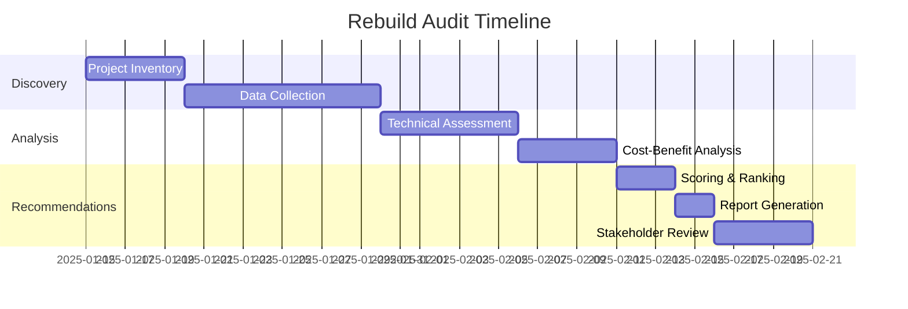

# Technical Audit Framework for Project Rebuild Assessment
## Bluefly.io Modernization Evaluation Guide

---

## Executive Summary

This framework provides a systematic approach to evaluate existing projects with `_REBUILD` folders to determine which should be migrated to Bluefly.io's modern GitLab-native, cloud-first architecture. The assessment covers technical debt, business value, migration complexity, and strategic alignment.

---

## 1. Project Inventory & Classification

### 1.1 Initial Discovery Metrics
- **Project Name & Identifier**
- **Current Production URL(s)**
- **Primary Stakeholder/Client**
- **Contract Status** (Active/Maintenance/Legacy)
- **Revenue Attribution** (Annual contract value)
- **Last Major Update** (Date of last significant feature/upgrade)
- **Current Tech Stack Version**
  - Drupal Version (7/8/9/10)
  - PHP Version
  - Database (MySQL/MariaDB version)
  - Hosting Platform (Acquia/AWS/Other)

### 1.2 Usage Analytics
- **Monthly Active Users** (MAU)
- **Page Views/Month**
- **API Calls/Month** (if applicable)
- **Content Items** (Nodes/Entities count)
- **User Accounts** (Active/Total)
- **Traffic Trends** (Growing/Stable/Declining)

### 1.3 Business Classification
- **Tier 1**: Mission-critical, high-revenue, high-visibility
- **Tier 2**: Important operational systems, moderate revenue
- **Tier 3**: Supporting systems, low revenue/internal tools
- **Tier 4**: Legacy/Sunset candidates

---

## 2. Technical Debt Assessment

### 2.1 Code Quality Metrics
```yaml
code_health:
  - custom_module_count: 
  - custom_theme_complexity:
  - contrib_module_count:
  - security_updates_pending:
  - deprecated_api_usage:
  - coding_standards_violations:
  - test_coverage_percentage:
  - documentation_completeness:
```

### 2.2 Architecture Evaluation
- **Monolithic vs Decoupled**
  - Frontend coupling level
  - API exposure/consumption
  - Service dependencies
  
- **Database Health**
  - Table count
  - Largest tables (GB)
  - Query performance issues
  - Custom schema modifications

- **File System**
  - Public files size (GB)
  - Private files size (GB)
  - Media management approach
  - CDN integration status

### 2.3 Security & Compliance Status
- **Last Security Audit Date**
- **Known Vulnerabilities** (Critical/High/Medium/Low)
- **Compliance Requirements**
  - WCAG 2.1 AA status
  - GDPR/Privacy compliance
  - FedRAMP/FISMA requirements
  - Industry-specific (HIPAA, PCI-DSS)
- **Authentication Method** (SSO/SAML/Local)
- **Encryption Status** (At-rest/In-transit)

### 2.4 Performance Baseline
- **Page Load Time** (p50/p95/p99)
- **Time to First Byte** (TTFB)
- **Core Web Vitals**
  - LCP (Largest Contentful Paint)
  - FID (First Input Delay)
  - CLS (Cumulative Layout Shift)
- **Database Query Performance**
- **Cache Hit Rates**
- **CDN Effectiveness**

---

## 3. Migration Complexity Analysis

### 3.1 Content Migration Scope
```yaml
content_assessment:
  content_types:
    - standard: [article, page, landing_page]
    - complex: [custom_entities, commerce_products]
    - media: [images, documents, videos]
  
  relationships:
    - entity_references: count
    - field_collections: count
    - paragraphs: count
    - custom_relationships: description
  
  multilingual:
    - languages: []
    - translation_method: 
    - content_negotiation:
```

### 3.2 Integration Inventory
- **Third-party Services**
  - Payment gateways
  - CRM systems
  - Marketing automation
  - Analytics platforms
  - Search services
  - Email services
  
- **API Dependencies**
  - Internal APIs consumed
  - External APIs consumed
  - APIs exposed
  - Webhook configurations

### 3.3 Custom Development Assessment
- **Custom Modules**
  - Business logic complexity
  - Drupal 11 compatibility
  - Refactoring requirements
  - Test coverage

- **Custom Themes**
  - Component library status
  - CSS framework (Tailwind/Bootstrap)
  - JavaScript framework usage
  - Build pipeline complexity

### 3.4 Data Migration Challenges
- **Database Size** (GB)
- **Migration Method Options**
  - Direct upgrade path available
  - Migration via Migrate API required
  - Manual data transformation needed
- **Downtime Tolerance** (hours)
- **Rollback Requirements**

---

## 4. Modern Architecture Alignment

### 4.1 GitLab-Native Readiness
```yaml
gitlab_assessment:
  current_vcs: [gitlab, github, bitbucket, other]
  ci_cd_maturity:
    - automated_testing: boolean
    - deployment_automation: level
    - environment_management: 
    - pipeline_complexity:
  
  proposed_improvements:
    - gitlab_ci_components: []
    - ml_integration_potential:
    - security_scanning:
    - dependency_management:
```

### 4.2 Cloud Architecture Fit
- **Current Infrastructure**
  - Hosting model (Shared/Dedicated/Cloud)
  - Scalability limitations
  - Disaster recovery capability
  
- **Target Architecture Benefits**
  - Auto-scaling potential
  - Multi-region requirements
  - Edge caching opportunities
  - Serverless function candidates

### 4.3 Drupal 11 Feature Utilization
- **Experience Builder** readiness
- **ECA (Event-Condition-Action)** opportunities
- **MCP Module** integration potential
- **API-First** architecture benefits
- **Decoupled/Headless** considerations

---

## 5. Cost-Benefit Analysis

### 5.1 Current State Costs
```yaml
operational_costs:
  hosting:
    monthly: $
    annual: $
  
  maintenance:
    hours_per_month:
    hourly_rate: $
    annual_cost: $
  
  security_updates:
    frequency:
    average_hours:
    annual_cost: $
  
  performance_issues:
    incident_count:
    resolution_hours:
    business_impact: $
```

### 5.2 Rebuild Investment Estimate
```yaml
rebuild_estimate:
  discovery_phase:
    hours: 
    cost: $
  
  development:
    architecture: hours
    content_migration: hours
    custom_development: hours
    testing: hours
    total_hours:
    total_cost: $
  
  deployment:
    hours:
    cost: $
  
  training:
    hours:
    cost: $
  
  total_investment: $
```

### 5.3 ROI Projections
- **Efficiency Gains**
  - Development velocity improvement
  - Deployment frequency increase
  - Incident reduction percentage
  
- **Cost Reductions**
  - Hosting optimization
  - Maintenance reduction
  - Security update automation
  
- **Business Benefits**
  - Performance improvements
  - User experience enhancements
  - Time-to-market acceleration
  - Competitive advantages

---

## 6. Risk Assessment

### 6.1 Technical Risks
| Risk Category | Description | Probability | Impact | Mitigation Strategy |
|--------------|-------------|-------------|---------|-------------------|
| Data Loss | Migration data corruption | Low | Critical | Comprehensive backup, staged migration |
| Compatibility | Module incompatibility | Medium | High | Thorough testing, phased approach |
| Performance | Degraded performance post-migration | Low | Medium | Performance testing, optimization |
| Integration | Third-party service disruption | Medium | High | API versioning, fallback systems |

### 6.2 Business Risks
- **Downtime Impact**
- **User Training Requirements**
- **Change Management Resistance**
- **Budget Overrun Potential**
- **Timeline Slippage Risk**

### 6.3 Opportunity Costs
- **Delayed Feature Development**
- **Competitive Disadvantage**
- **Technical Debt Accumulation**
- **Security Vulnerability Exposure**

---

## 7. Recommendation Framework

### 7.1 Decision Matrix Score (0-100)
```yaml
scoring_criteria:
  business_value: 
    weight: 30%
    factors: [revenue, users, strategic_importance]
  
  technical_debt: 
    weight: 25%
    factors: [code_quality, security, performance]
  
  migration_complexity:
    weight: 20%
    factors: [content, integrations, customizations]
  
  roi_potential:
    weight: 15%
    factors: [cost_savings, efficiency_gains]
  
  risk_level:
    weight: 10%
    factors: [technical, business, timeline]
```

### 7.2 Rebuild Priority Categories

#### Immediate Rebuild (Score: 80-100)
- Critical business systems
- High security risk
- Significant ROI within 12 months
- Strategic alignment essential

#### Planned Rebuild (Score: 60-79)
- Important operational systems
- Moderate technical debt
- ROI within 18-24 months
- Good modernization candidate

#### Incremental Modernization (Score: 40-59)
- Stable systems with specific pain points
- Partial rebuild beneficial
- Phased approach recommended

#### Maintain Current (Score: 20-39)
- Low business impact
- Acceptable technical state
- Limited ROI potential

#### Sunset Candidate (Score: 0-19)
- Minimal usage
- High migration cost vs. benefit
- Consider retirement/consolidation

---

## 8. Project-Specific Evaluation Template

### Project: [PROJECT_NAME]

#### Executive Summary
- **Rebuild Recommendation**: [Yes/No/Partial]
- **Priority Level**: [Immediate/Planned/Deferred]
- **Estimated Timeline**: [X months]
- **Estimated Investment**: [$X]
- **Expected ROI**: [X months]

#### Key Findings
1. **Strengths**
   - 
2. **Weaknesses**
   - 
3. **Opportunities**
   - 
4. **Threats**
   - 

#### Technical Highlights
- **Migration Path**: [Direct/Staged/Hybrid]
- **Major Challenges**: 
- **Quick Wins**:

#### Recommended Approach
1. **Phase 1**: [Description, Timeline, Cost]
2. **Phase 2**: [Description, Timeline, Cost]
3. **Phase 3**: [Description, Timeline, Cost]

#### Success Metrics
- 
- 
- 

---

## 9. Implementation Roadmap

### 9.1 Audit Execution Plan


### 9.2 Resource Requirements
- **Audit Team Composition**
  - Technical Architect (Lead)
  - DevOps Engineer
  - Drupal Developer
  - Business Analyst
  
- **Tools & Access Needed**
  - Production environment access
  - Analytics platforms
  - Code repositories
  - Performance monitoring tools
  - Security scanning tools

### 9.3 Deliverables
1. **Project Inventory Spreadsheet**
2. **Individual Project Assessment Reports**
3. **Prioritized Rebuild Roadmap**
4. **Budget & Resource Plan**
5. **Risk Mitigation Strategies**
6. **Executive Presentation**

---

## 10. Appendices

### A. Automation Scripts
```bash
#!/bin/bash
# Project discovery script
# Scans for _REBUILD folders and collects basic metrics

find /path/to/projects -type d -name "_REBUILD" | while read rebuild_dir; do
    project_dir=$(dirname "$rebuild_dir")
    echo "Analyzing: $project_dir"
    # Add automated collection logic
done
```

### B. Data Collection Templates
- [Link to metrics collection spreadsheet]
- [Link to stakeholder questionnaire]
- [Link to technical assessment checklist]

### C. Reference Documentation
- Bluefly.io Modern Architecture Standards
- GitLab CI/CD Best Practices
- Drupal 11 Migration Guide
- Cloud Migration Playbook

---

## Document Metadata
- **Version**: 1.0
- **Created**: January 2025
- **Author**: Bluefly.io Technical Architecture Team
- **Review Cycle**: Quarterly
- **Next Review**: April 2025

---

*This framework should be customized based on your specific organizational needs and technical standards. Regular updates ensure alignment with evolving best practices and business requirements.*